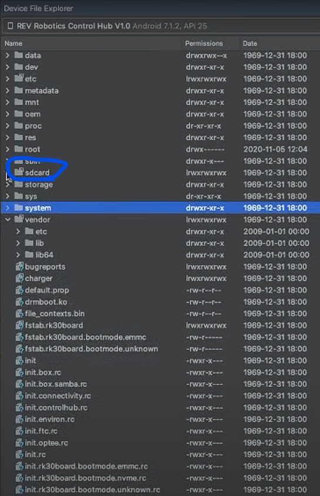

# FTC Roadrunner Tutorial

An easy beginner Tutorial for Road Runner.

## Description

Utilizes RoadRunner trajectories and April tags for the robot’s autonomous phase.

***Requires Android Studios***
Download Android Studios [Click Here](https://developer.android.com/studio)

## Getting Started

### Dependencies

Roadrunner [Document](https://learnroadrunner.com)

April Tags
Download Tags here ----[Tags](https://drive.google.com/file/d/1cakdgu8sm0rb3wR9s2KzWXF_8raeuafy/view?usp=sharing)

### Installing

1) Download the Zip file by pressing "CODE" then press "Download ZIP"
2) Extract the zip file
3) Open the file in Android Studios
4) Sync project with Gradle (Elephant icon)

### Setting Up April Tag
1) Download [libOpenCvAndroid453.so](https://drive.google.com/file/d/1XX_7nesg6d4QWU9ee3rvkTZweq03E1ey/view?usp=sharing)
2) Connect to the Rev Control Hub via USB
3) Open "Device File Explore" in Android Studios
4) Locate "sdcard"

5) Locate "First" under "sdcard"

6) Once you've located the file name "First" drag the libOpenCvAndroid453.so file on top of the "First" file (will be highlighted) to upload.
7) To confirm if done correctly the file will be locate under "First"

8) Once done April Tags are setup

## Authors

Eduardo [Team 9102]

